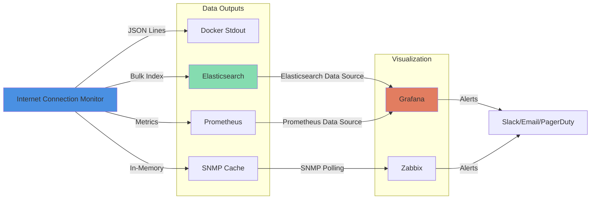

# Elasticsearch and Grafana Integration

## Test Result JSON Document Structure

Each test produces a single JSON document that is:
1. Written to stdout as a JSON line (for Docker logs)
2. Pushed to Elasticsearch (if enabled)
3. Used to update Prometheus metrics
4. Cached in memory for SNMP polling

### Complete JSON Document Example

```json
{
  "@timestamp": "2025-01-08T15:23:45.123Z",
  "test_id": "550e8400-e29b-41d4-a716-446655440000",
  "site": {
    "url": "https://www.google.com",
    "name": "google",
    "category": "search"
  },
  "status": {
    "success": true,
    "http_status": 200,
    "error": null
  },
  "timings": {
    "dns_lookup_ms": 12,
    "tcp_connection_ms": 45,
    "tls_handshake_ms": 89,
    "time_to_first_byte_ms": 156,
    "dom_content_loaded_ms": 432,
    "network_idle_ms": 1234,
    "total_duration_ms": 1456
  },
  "browser": {
    "user_agent": "Mozilla/5.0 (X11; Linux x86_64) AppleWebKit/537.36...",
    "viewport": "1920x1080"
  },
  "environment": {
    "monitor_hostname": "internet-monitor-01",
    "monitor_version": "1.0.0"
  }
}
```

### Failed Test Example (v1.3.0+)

```json
{
  "@timestamp": "2025-11-11T14:28:40.859Z",
  "test_id": "660e8400-e29b-41d4-a716-446655440001",
  "site": {
    "url": "https://example-down-site.com",
    "name": "example-site",
    "category": "test"
  },
  "status": {
    "success": false,
    "message": "Failed to load page"
  },
  "error": {
    "error_type": "ERR_CONNECTION_TIMED_OUT",
    "error_message": "page load error net::ERR_CONNECTION_TIMED_OUT",
    "failure_phase": "tcp"
  },
  "timings": {
    "dns_lookup_ms": 12,
    "tcp_connection_ms": null,
    "tls_handshake_ms": null,
    "time_to_first_byte_ms": null,
    "dom_content_loaded_ms": null,
    "network_idle_ms": null,
    "total_duration_ms": 30001
  },
  "metadata": {
    "hostname": "internet-monitor-01",
    "version": "1.3.0"
  }
}
```

### Error Object Fields (v1.3.0+)

The `error` object provides detailed failure information:

- **error_type** (string, keyword): Chrome's error code or simplified type
  - Chrome network errors: `ERR_NAME_NOT_RESOLVED`, `ERR_CONNECTION_REFUSED`, `ERR_CONNECTION_TIMED_OUT`, `ERR_CERT_AUTHORITY_INVALID`, `ERR_ABORTED`, etc.
  - Fallback types: `timeout` (chromedp timeout), `unknown` (unclassified error)

- **error_message** (text): Full error message from Chrome/chromedp
  - Example: `"page load error net::ERR_NAME_NOT_RESOLVED"`

- **failure_phase** (keyword): Which network layer failed (inferred from timing data)
  - `dns` - DNS resolution failed (no DNS timing)
  - `tcp` - TCP connection failed (has DNS, no TCP)
  - `tls` - TLS handshake failed (has TCP, no TLS - HTTPS only)
  - `http` - HTTP request failed (has connection timing, no TTFB)
  - `unknown` - Phase couldn't be determined

- **stack_trace** (text, optional): Error stack trace for debugging

### Common Chrome Error Codes

**DNS errors (failure_phase: "dns"):**
- `ERR_NAME_NOT_RESOLVED` - Hostname doesn't resolve
- `ERR_DNS_TIMED_OUT` - DNS server timeout
- `ERR_DNS_MALFORMED_RESPONSE` - Invalid DNS response
- `ERR_DNS_SERVER_FAILED` - DNS server error

**TCP errors (failure_phase: "tcp"):**
- `ERR_CONNECTION_REFUSED` - Port not listening
- `ERR_CONNECTION_RESET` - Connection reset by peer
- `ERR_CONNECTION_TIMED_OUT` - TCP handshake timeout
- `ERR_CONNECTION_FAILED` - Generic connection failure
- `ERR_CONNECTION_ABORTED` - Connection aborted

**TLS errors (failure_phase: "tls"):**
- `ERR_SSL_PROTOCOL_ERROR` - TLS protocol error
- `ERR_CERT_AUTHORITY_INVALID` - Invalid certificate authority
- `ERR_CERT_DATE_INVALID` - Certificate expired/not yet valid
- `ERR_CERT_COMMON_NAME_INVALID` - Hostname mismatch
- `ERR_SSL_VERSION_OR_CIPHER_MISMATCH` - Incompatible TLS version/cipher

**HTTP/Application errors (failure_phase: "http"):**
- `ERR_ABORTED` - Request aborted (phase inferred from timing)
- `ERR_TIMED_OUT` - HTTP request timeout
- `ERR_EMPTY_RESPONSE` - Server closed connection without response

## Elasticsearch Index Template

### Index Naming Pattern
```
internet-connection-monitor-YYYY.MM.DD
```

Daily indices allow for easy data lifecycle management (delete old indices after N days).

### Index Mapping

```json
{
  "mappings": {
    "properties": {
      "@timestamp": {
        "type": "date"
      },
      "test_id": {
        "type": "keyword"
      },
      "site": {
        "properties": {
          "url": {
            "type": "keyword"
          },
          "name": {
            "type": "keyword"
          },
          "category": {
            "type": "keyword"
          }
        }
      },
      "status": {
        "properties": {
          "success": {
            "type": "boolean"
          },
          "http_status": {
            "type": "integer"
          },
          "error": {
            "properties": {
              "type": {
                "type": "keyword"
              },
              "message": {
                "type": "text"
              },
              "timestamp": {
                "type": "date"
              }
            }
          }
        }
      },
      "timings": {
        "properties": {
          "dns_lookup_ms": {
            "type": "integer"
          },
          "tcp_connection_ms": {
            "type": "integer"
          },
          "tls_handshake_ms": {
            "type": "integer"
          },
          "time_to_first_byte_ms": {
            "type": "integer"
          },
          "dom_content_loaded_ms": {
            "type": "integer"
          },
          "network_idle_ms": {
            "type": "integer"
          },
          "total_duration_ms": {
            "type": "integer"
          }
        }
      },
      "browser": {
        "properties": {
          "user_agent": {
            "type": "text"
          },
          "viewport": {
            "type": "keyword"
          }
        }
      },
      "environment": {
        "properties": {
          "monitor_hostname": {
            "type": "keyword"
          },
          "monitor_version": {
            "type": "keyword"
          }
        }
      }
    }
  }
}
```

## Grafana Dashboard Design

### Dashboard Overview

**Dashboard Name**: Internet Connection Monitor
**Purpose**: Monitor real-world Internet connectivity from user perspective
**Time Range**: Default last 24 hours, support up to 90 days

### Key Dashboard Features

#### Time Bucketing and Aggregation
All time series charts use Elasticsearch `date_histogram` aggregations with intelligent bucketing:
- **Fixed 2-minute intervals**: Provides smooth charts for both short (15-minute) and long (6-hour+) time ranges
- **Only data points with events**: `min_doc_count: 1` ensures only time buckets containing actual data are returned
- **Natural aggregation**: Multiple events within each time bucket are automatically aggregated (avg, count, percentiles)
- **No empty buckets**: Eliminates null values and reduces query overhead
- **Clear visibility of downtime**: When monitoring stops, you see an actual gap in the line, not a connected line through empty data

With 2-minute buckets:
- A full test cycle (~25-30 seconds for all 5 sites) fits within one bucket
- Each bucket contains 4-5 complete test cycles, providing good statistical sampling
- 15-minute view: ~7-8 data points (smooth)
- 6-hour view: ~180 data points (very smooth)

#### Handling Data Gaps
All time series charts use a **2.5-minute disconnect threshold** (`insertNulls: 150000`):
- **Short gaps (< 2.5 minutes)**: Lines connect across the gap (e.g., one missing 2-minute bucket)
- **Long gaps (≥ 2.5 minutes)**: Charts show clear breaks in the line (monitoring was down)
- **Distinguishes from failures**: A gap means monitoring was interrupted; data points at zero/low values mean actual failures
- **Example**: If monitoring stops for 5+ minutes, you'll see a gap in the chart, making it obvious that monitoring was interrupted

This threshold is set slightly larger than the 2-minute bucket interval to allow for minor timing variations while still showing clear gaps when one or more data buckets are completely missing.

#### Success vs Failure Visualization
The "Success and Failure Rate Over Time" chart is a **stacked area chart** that always sums to 100%:
- **Green area (Success Rate)**: Percentage of successful tests
- **Red area (Failure Rate)**: Percentage of failed tests (calculated as 1 - Success Rate)

Key features:
- **Always sums to 100%**: When there's test data, success + failure = 100%
- **Clear failure visibility**: Red area appears when there are failures
- **Distinguishes missing data**: Gaps in the chart indicate monitoring was down (no test data)
- **Stacked visualization**: Easy to see the proportion of success vs failure at any point in time

Example interpretations:
- 100% green: All tests passing
- 95% green, 5% red: 5% failure rate
- Gap in chart: Monitoring was not running during that period

### Panel Layout

```
+------------------------------------------+
|  Success Rate - Single Stat             |
+------------------------------------------+
|  Avg Latency - Single Stat              |
+------------------------------------------+

+--------------------+---------------------+
| Success & Failure  | Total Duration      |
| Rate (Time Series) | (Time Series)       |
|                    |                     |
|                    |                     |
+--------------------+---------------------+

+--------------------+---------------------+
| DNS Lookup Times   | TLS Handshake       |
| (Time Series)      | (Time Series)       |
|                    |                     |
+--------------------+---------------------+

+------------------------------------------+
| Success Rate by Site (Bar Gauge)         |
+------------------------------------------+

+------------------------------------------+
| Error Types (Pie Chart)                  |
+------------------------------------------+

+------------------------------------------+
| Recent Failures (Table)                  |
+------------------------------------------+
```

### Panel Definitions

#### 1. Success Rate (Single Stat)
**Query**: Uses the dashboard's selected time range
```
{
  "query": {
    "bool": {
      "filter": [
        { "range": { "@timestamp": { "gte": "$__timeFrom", "lte": "$__timeTo" } } }
      ]
    }
  },
  "aggs": {
    "success_rate": {
      "avg": {
        "field": "status.success"
      }
    }
  }
}
```

**Visualization**: Single Stat showing percentage (0-100%)
**Thresholds**: Green >99%, Yellow 95-99%, Red <95%
**Note**: Displays the average success rate for the selected time range in Grafana

#### 2. Average Latency (Single Stat)
**Query**: Uses the dashboard's selected time range
```
{
  "query": {
    "bool": {
      "filter": [
        { "range": { "@timestamp": { "gte": "$__timeFrom", "lte": "$__timeTo" } } },
        { "term": { "status.success": true } }
      ]
    }
  },
  "aggs": {
    "avg_latency": {
      "avg": {
        "field": "timings.total_duration_ms"
      }
    }
  }
}
```

**Visualization**: Single Stat showing milliseconds
**Thresholds**: Green <2000ms, Yellow 2000-5000ms, Red >5000ms
**Note**: Displays the average latency for the selected time range in Grafana

#### 3. Success and Failure Rate Over Time (Stacked Area Chart)
**Query**:
- **Query A (Success Rate)**: Average of `status.success` field (boolean, 0 or 1) across all tests in each time bucket
- **Query B (Failure Rate)**: Grafana math expression: `1 - $A` (automatically calculates failure percentage)

```elasticsearch
{
  "query": {
    "bool": {
      "filter": [
        { "range": { "@timestamp": { "gte": "$__timeFrom", "lte": "$__timeTo" } } }
      ]
    }
  },
  "aggs": {
    "time_buckets": {
      "date_histogram": {
        "field": "@timestamp",
        "interval": "auto",
        "min_doc_count": 1
      },
      "aggs": {
        "success_rate": {
          "avg": {
            "field": "status.success"
          }
        }
      }
    }
  }
}
```

**Visualization**: Stacked area chart (percent mode)
- **Green area (Success Rate)**: Percentage of successful tests
- **Red area (Failure Rate)**: Percentage of failed tests (1 - Success Rate)
- **Stacking mode**: Percent (always sums to 100%)

**Key Features**:
- Data aggregated into time buckets (interval adjusts automatically based on time range)
- Both metrics shown as percentages that sum to 100%
- Gaps indicate periods with no monitoring data
- Clear visual distinction between success (green) and failure (red)
- Fill opacity: 50% for clear visibility of both areas

**Legend**: Shows mean of each rate

#### 4. Total Duration Over Time (Time Series)
**Query**:
```
{
  "query": {
    "bool": {
      "filter": [
        { "range": { "@timestamp": { "gte": "$__timeFrom", "lte": "$__timeTo" } } },
        { "term": { "status.success": true } }
      ]
    }
  },
  "aggs": {
    "time_buckets": {
      "date_histogram": {
        "field": "@timestamp",
        "fixed_interval": "5m"
      },
      "aggs": {
        "avg_duration": {
          "avg": {
            "field": "timings.total_duration_ms"
          }
        },
        "p95_duration": {
          "percentiles": {
            "field": "timings.total_duration_ms",
            "percents": [95]
          }
        },
        "p99_duration": {
          "percentiles": {
            "field": "timings.total_duration_ms",
            "percents": [99]
          }
        }
      }
    }
  }
}
```

**Visualization**: Multi-line chart showing avg, p95, p99
**Y-Axis**: Duration (ms)
**Legend**: Show all percentiles
**Note**: Data aggregated into time buckets; gaps indicate periods with no monitoring data

#### 5. DNS Lookup Times (Time Series)
**Query**: Similar to #4 but for `timings.dns_lookup_ms`

**Visualization**: Line chart with percentiles
**Purpose**: Identify DNS resolution issues
**Note**: Data aggregated into time buckets; gaps indicate periods with no monitoring data

#### 6. TLS Handshake Times (Time Series)
**Query**: Similar to #4 but for `timings.tls_handshake_ms`

**Visualization**: Line chart with percentiles
**Purpose**: Identify TLS/SSL issues
**Note**: Data aggregated into time buckets; gaps indicate periods with no monitoring data

#### 7. Success Rate by Site (Bar Gauge)
**Query**:
```
{
  "query": {
    "bool": {
      "filter": [
        { "range": { "@timestamp": { "gte": "now-24h" } } }
      ]
    }
  },
  "aggs": {
    "by_site": {
      "terms": {
        "field": "site.name",
        "size": 20
      },
      "aggs": {
        "success_rate": {
          "avg": {
            "field": "status.success"
          }
        }
      }
    }
  }
}
```

**Visualization**: Horizontal bar gauge
**Purpose**: Quick comparison across sites
**Thresholds**: Same as single stat

#### 8. Error Types (Pie Chart)
**Query**:
```
{
  "query": {
    "bool": {
      "filter": [
        { "range": { "@timestamp": { "gte": "now-24h" } } },
        { "term": { "status.success": false } }
      ]
    }
  },
  "aggs": {
    "error_types": {
      "terms": {
        "field": "status.error.type",
        "size": 10
      }
    }
  }
}
```

**Visualization**: Pie chart or donut chart
**Purpose**: Understand failure modes (timeout, DNS, connection refused, etc.)

#### 9. Recent Failures (Table)
**Query**:
```
{
  "query": {
    "bool": {
      "filter": [
        { "range": { "@timestamp": { "gte": "now-24h" } } },
        { "term": { "status.success": false } }
      ]
    }
  },
  "sort": [
    { "@timestamp": { "order": "desc" } }
  ],
  "size": 50
}
```

**Visualization**: Table showing:
- Timestamp
- Site Name
- Error Type
- Error Message
- Duration (if available)

**Purpose**: Detailed debugging of failures

## Is This Easily Rendered in Grafana?

### ✅ YES - This Structure is Grafana-Friendly

**Reasons:**

1. **Time-series data**: `@timestamp` field is standard for Elasticsearch time-series
2. **Keyword fields**: Site names, error types, etc. are perfect for aggregations
3. **Numeric metrics**: All timing fields are integers, easy to aggregate (avg, percentile, etc.)
4. **Boolean success flag**: Simple averaging gives success rate percentage
5. **Nested structure**: Grafana handles nested objects well with dot notation (`site.name`, `timings.dns_lookup_ms`)
6. **Standard patterns**: The document structure follows Elasticsearch/Grafana best practices

### Grafana Features We Can Use

- **Date Histogram**: Automatic time bucketing for time-series charts
- **Terms Aggregations**: Group by site, error type, etc.
- **Percentiles**: Built-in p50, p95, p99 calculations
- **Filters**: Easy to filter by success/failure, site, time range
- **Variables**: Create dashboard variables for site selection, time window
- **Alerts**: Set up alert rules on success rate, latency thresholds
- **Transformations**: Calculate rates, deltas, moving averages

### Sample Grafana Variables

```
$site_name    - Multi-select dropdown from site.name field
$category     - Multi-select dropdown from site.category field
$interval     - Auto-interval for time buckets (1m, 5m, 15m, 1h)
```

### Sample Alert Rules

1. **Success Rate Alert**:
   - Condition: Success rate < 95% for 15 minutes
   - Notification: Slack, Email, PagerDuty

2. **High Latency Alert**:
   - Condition: P95 latency > 5000ms for 10 minutes
   - Notification: Slack, Email

3. **Site Down Alert**:
   - Condition: Specific site has 0% success rate for 5 minutes
   - Notification: PagerDuty

## Grafana Dashboard JSON Export

A complete Grafana dashboard JSON is quite large. Here's the structure:

```json
{
  "dashboard": {
    "title": "Internet Connection Monitor",
    "tags": ["internet", "monitoring", "connectivity"],
    "timezone": "browser",
    "refresh": "1m",
    "time": {
      "from": "now-24h",
      "to": "now"
    },
    "templating": {
      "list": [
        {
          "name": "site_name",
          "type": "query",
          "datasource": "Elasticsearch",
          "query": "{\"find\": \"terms\", \"field\": \"site.name\"}",
          "multi": true,
          "includeAll": true
        }
      ]
    },
    "panels": [
      // Panel definitions as described above
    ]
  }
}
```

## Data Flow Diagram



## Example Grafana Queries by Use Case

### "Is my Internet working right now?"
**Panel**: Single stat with 5-minute success rate
```
Last 5 minutes success rate across all sites
Green = 100%, Red = <100%
```

### "Which site is having problems?"
**Panel**: Bar gauge of success rate by site (last hour)
```
One bar per site, sorted by success rate (lowest first)
```

### "How fast is my Internet compared to yesterday?"
**Panel**: Time series with compare to yesterday
```
Average total_duration_ms with timeshift -24h overlay
```

### "What's causing failures?"
**Panel**: Pie chart of error types
```
Distribution of timeout, DNS, connection refused, etc.
```

### "Which network layer is failing?" (v1.3.0+)
**Panel**: Pie chart of failures by phase
```
Distribution across DNS, TCP, TLS, HTTP layers
```

**Query Example:**
```json
{
  "query": "status.success:false",
  "aggs": {
    "phase_distribution": {
      "terms": {
        "field": "error.failure_phase.keyword",
        "size": 10
      }
    }
  }
}
```

### "Detailed error analysis by phase" (v1.3.0+)
**Panel**: Table showing error types grouped by failure phase
```
Shows which specific Chrome errors occur at each network layer
```

**Useful queries for troubleshooting:**

```bash
# All DNS failures (any DNS-related error)
error.failure_phase: "dns"

# Specific Chrome error
error.error_type: "ERR_NAME_NOT_RESOLVED"

# All timeouts across all phases
error.error_type: "timeout" OR error.error_type: "ERR_CONNECTION_TIMED_OUT" OR error.error_type: "ERR_TIMED_OUT"

# TCP layer issues (connection problems)
error.failure_phase: "tcp"

# TLS certificate issues
error.failure_phase: "tls"

# HTTP layer failures (connection succeeded, but HTTP request failed)
error.failure_phase: "http"

# Failures that made it past TLS but failed at HTTP
error.failure_phase: "http" AND timings.tls_handshake_ms: *

# Sites with the most DNS failures
{
  "query": "error.failure_phase:dns",
  "aggs": {
    "top_sites": {
      "terms": {
        "field": "site.name.keyword",
        "size": 10
      }
    }
  }
}
```

### "Detailed failure investigation"
**Panel**: Table of recent failures with expandable error messages
```
Show timestamp, site, error type, failure phase, full error message
```

**Updated columns for v1.3.0:**
- @timestamp
- site.name
- error.error_type (now shows Chrome codes like ERR_NAME_NOT_RESOLVED)
- error.failure_phase (NEW: dns, tcp, tls, http, unknown)
- error.error_message
- timings.total_duration_ms

## Retention and Performance

### Elasticsearch Settings

- **Index per day**: `internet-connection-monitor-2025.01.08`
- **Retention**: 90 days (configurable via ILM policy)
- **Rollover**: Daily at midnight
- **Replicas**: 1 (for redundancy)
- **Shards**: 1 per index (low data volume)

### Expected Data Volume

With default configuration:
- **5 sites** tested continuously
- **~3 seconds** average load time + 2s delay = 5s per test
- **720 tests/hour** (one full cycle every 25s)
- **~17,280 tests/day**
- **~1 KB per document**
- **~17 MB/day** raw data
- **~1.5 GB** for 90-day retention

This is very manageable for Elasticsearch.

## Setup Instructions

### 1. Create Elasticsearch Index Template

```bash
curl -X PUT "http://elasticsearch:9200/_index_template/internet-connection-monitor" \
  -H 'Content-Type: application/json' \
  -d @elasticsearch-index-template.json
```

### 2. Configure Monitor

```yaml
# config.yaml
outputs:
  elasticsearch:
    enabled: true
    endpoint: "http://elasticsearch:9200"
    index_pattern: "internet-connection-monitor-%{+yyyy.MM.dd}"
    username: "monitor_user"
    password: "secret"
    bulk_size: 50
    flush_interval: 10s
```

### 3. Import Grafana Dashboard

1. Go to Grafana → Dashboards → Import
2. Upload `grafana-dashboard.json`
3. Select Elasticsearch data source
4. Click Import

### 4. Set Up Alerts (Optional)

Configure notification channels in Grafana:
- Slack webhook
- Email SMTP
- PagerDuty integration

Then enable alert rules on relevant panels.

## Conclusion

**The JSON document structure is highly optimized for Grafana rendering:**

✅ Flat-enough structure for easy querying
✅ Keyword fields for aggregations
✅ Integer timing fields for statistics
✅ Boolean success flag for rate calculations
✅ Timestamp field for time-series
✅ Standard Elasticsearch patterns
✅ Supports all common Grafana visualizations
✅ Efficient queries (no complex joins or transforms needed)

**The data will render beautifully in Grafana with minimal effort.**
